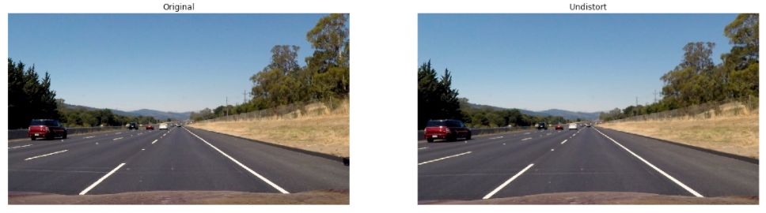
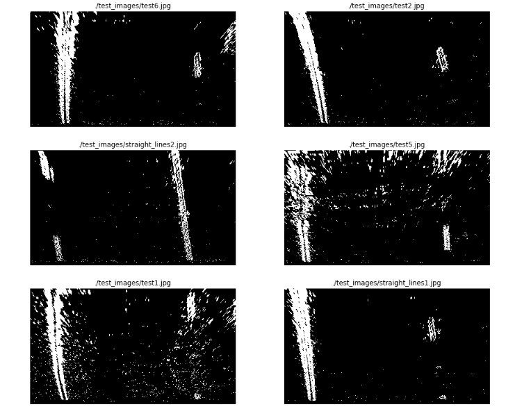

## **Advanced Lane Finding Project**

The goals / steps of this project are the following:

* Compute the camera calibration matrix and distortion coefficients given a set of chessboard images.
* Apply a distortion correction to raw images.
* Use color transforms, gradients, etc., to create a thresholded binary image.
* Apply a perspective transform to rectify binary image ("birds-eye view").
* Detect lane pixels and fit to find the lane boundary.
* Determine the curvature of the lane and vehicle position with respect to center.
* Warp the detected lane boundaries back onto the original image.
* Output visual display of the lane boundaries and numerical estimation of lane curvature and vehicle position.

[//]: # (Image References)

[image1]: ./examples/undistort_output.png "Undistorted"
[image2]: ./test_images/test1.jpg "Road Transformed"
[image3]: ./examples/binary_combo_example.jpg "Binary Example"
[image4]: ./examples/warped_straight_lines.jpg "Warp Example"
[image5]: ./examples/color_fit_lines.jpg "Fit Visual"
[image6]: ./examples/example_output.jpg "Output"
[video1]: ./video_output/project_video.mp4 "Video"

## [Rubric](https://review.udacity.com/#!/rubrics/571/view) Points

### Here I will consider the rubric points individually and describe how I addressed each point in my implementation.  

---

### Writeup / README

#### 1. Provide a Writeup / README that includes all the rubric points and how you addressed each one.  You can submit your writeup as markdown or pdf.  [Here](https://github.com/udacity/CarND-Advanced-Lane-Lines/blob/master/writeup_template.md) is a template writeup for this project you can use as a guide and a starting point.  

You're reading it!

### Camera Calibration

#### 1. Briefly state how you computed the camera matrix and distortion coefficients. Provide an example of a distortion corrected calibration image.

The code for this step is contained in the first code cell of the IPython notebook located in "./Advance Lane Finding.ipynb"

I start by preparing "object points", which will be the (x, y, z) coordinates of the chessboard corners in the world. Here I am assuming the chessboard is fixed on the (x, y) plane at z=0, such that the object points are the same for each calibration image.  Thus, `objp` is just a replicated array of coordinates, and `objpoints` will be appended with a copy of it every time I successfully detect all chessboard corners in a test image.  `imgpoints` will be appended with the (x, y) pixel position of each of the corners in the image plane with each successful chessboard detection.  

I then used the output `objpoints` and `imgpoints` to compute the camera calibration and distortion coefficients using the `cv2.calibrateCamera()` function.  I applied this distortion correction to the test image using the `cv2.undistort()` function and obtained this result: 


### Pipeline (single images)

#### 1. Provide an example of a distortion-corrected image.
The camera calibration calculation was done on the [Advance Lane Finding](Advance%20Lane%20Finding.ipynb). The result is load with `pickle` on `In[2]`.
The following image shows the result of applying the camera calibration to one of the test images:



#### 2. Describe how (and identify where in your code) you used color transforms, gradients or other methods to create a thresholded binary image. Provide an example of a binary image result.

The code used to experiment with color, gradients, and thresholds could be found on the [Advance Lane Finding](Advance%20Lane%20Finding.ipynb).

A color transformation to HLS was done `In [15]` and the S channel was selected because it shows more contracts on the lane lines as shown in the next figure:


After the color transformation had been done, it was time for gradients. The following gradients were calculated:

- Sobel X and Sobel Y: `In [45]` and `In [46]`
- Magnitude : `In [48]`
- Gradient direction : `In [50]`
- Combination of all the above (Sobel X and Sobel Y) or (Magnitude and Gradient): `In [51]`

After a few back-and-forward exploration with thresholds, the following picture will show the different gradients on some test images side-by-side:


The full combination of these gradients leads to a "noisy" binary image. That is why on the main notebook [Advance Lane Finding](Advance%20Lane%20Finding.ipynb). Only the combination of Sobel X and Sobel Y was used to continue with the pipeline. The following image shows the binary image obtained with that combination on the test images:


On the [Advance Lane Finding](Advance%20Lane%20Finding.ipynb)., the code used to calculate this images is from `In [14]` to `In [52]`.

#### 3. Describe how (and identify where in your code) you performed a perspective transform and provided an example of a transformed image.

The perspective transformation code could be found on [Advance Lane Finding](Advance%20Lane%20Finding.ipynb). The image used were the one with lane lines:


Four points where selected on the first image as the source of the perspective transformation. Those points are highlighted on the following image (`In [54]`):


The destination points for the transformation where to get a clear picture of the street:

|Source|Destination|
|-----:|----------:|
|(585, 475)|(200,0)|
|(705, 475)|(maxX - 200, 0)|
|(1250, 720)|(maxX - 200, maxY)|
|(190, 720)|(200, maxY)|

Using `cv2.getPerspectiveTransform`, a transformation matrix was calculated, and an inverse transformation matrix was also calculated to map the points back to the original space (`In [55]`). The result of the transformation on a test image is the following:


The transformation matrix and the inverse transformation matrix was stored using `pickle` to be used on the main notebook [Advance Lane Finding](Advance%20Lane%20Finding.ipynb). The following picture shows the binary images results after the perspective transformation:



#### 4. Describe how (and identify where in your code) you identified lane-line pixels and fit their positions with a polynomial?

The line detection code could be found at `In [60]` of the [Advance Lane Finding](Advance%20Lane%20Finding.ipynb). The algorithm calculates the histogram on the X axis. Finds the picks on the right and left side of the image, and collect the non-zero points contained on those windows. When all the points are collected, a polynomial fit is used (using `np.polyfit`) to find the line model. On the same code, another polynomial fit is done on the same points transforming pixels to meters to be used later on the curvature calculation. The following picture shows the points found on each window, the windows and the polynomials:


#### 5. Describe how (and identify where in your code) you calculated the radius of curvature of the lane and the position of the vehicle on the center.

On the step 4 a polynomial was calculated on the meters space to be used here to calculate the curvature. The formula is the following:

```
((1 + (2*fit[0]*yRange*ym_per_pix + fit[1])**2)**1.5) / np.absolute(2*fit[0])
```

where `fit` is the the array containing the polynomial, `yRange` is the max Y value and `ym_per_pix` is the meter per pixel value.

To find the vehicle position on the center:

- Calculate the lane center by evaluating the left and right polynomials at the maximum Y and find the middle point.
- Calculate the vehicle center transforming the center of the image from pixels to meters.
- The sign between the distance between the lane center and the vehicle center gives if the vehicle is on to the left or the right.

The code used to calculate this could be found at `In [61]`.

#### 6. Provide an example image of your result plotted back down onto the road such that the lane area is identified clearly.

To display the lane lines on the image, the polynomials where evaluated on a lineal space of the Y coordinates. The generated points where mapped back to the image space using the inverse transformation matrix generated by the perspective transformation. The code used for this operation could be found on `In [64]`, and the following images are examples of this mapping:


### Pipeline (video)

#### 1. Provide a link to your final video output. Your pipeline should perform reasonably well on the entire project video (wobbly lines are ok but no catastrophic failures that would cause the car to drive off the road!).

After some refactoring of the code found at `In [66]`, the project video was processed and the results at [video_output](./video_output/project_video_output.mp4)

### Discussion

#### 1. Briefly, discuss any problems/issues you faced in your implementation of this project. Where will your pipeline likely fail? What could you do to make it more robust?
- Ploated area on road is fluctuate that need to improve it.
- The first problem is to find the correct source and destination points. It is a try and error approach and even if few pixels up and down can make a big impact. The second problem is when I was trying to use various combinations of color channels the final combination did not work in almost all conditions. It was again by hit and trial I figured out bad frames and checked my pipleline and made changes to and/or operators and thresholds. The next challenge and the biggest problem is to stop flickering of lane lines on concrete surface or when the car comes out from the shadow.

- I tried my pipeline on the challenge video and I noticed it failed. 